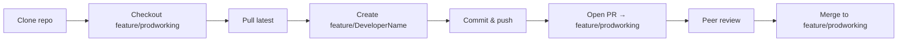

# Activity Platform — Git Workflow

This document defines the standard Git workflow for all Activity platform codebases. The same process applies to **API**, **Admin UI**, and **Mobile App**.

---

## Overview

| Item | Value |
|------|--------|
| **Production base branch** | `feature/prodworking` |
| **Developer branch pattern** | `feature/<DeveloperName>` |
| **Merge target for PRs** | `feature/prodworking` |
| **Review** | Peer review required before merge |



---

## Repositories

| Project | Repository | Clone URL |
|---------|------------|-----------|
| **API** | `activity_api` | `https://github.com/kaymyactivity/activity_api.git` |
| **Admin UI** | `admin_ui` | `https://github.com/kaymyactivity/admin_ui.git` |
| **Mobile App** | `activity_app` | `https://github.com/kaymyactivity/activity_app.git` |

> **Note:** The workflow and commands are identical for all three repos—only the clone URL changes.

---

## Developer Branches

Each developer maintains a **personal feature branch** named after them. Create it from the latest `feature/prodworking`.

| Developer | Branch name |
|-----------|-------------|
| Anand | `feature/Anand` |
| Thiru | `feature/Thiru` |
| Ramu | `feature/Ramu` |

Use the same naming pattern for new team members: `feature/<FirstName>` (PascalCase, matching existing convention).

---

## Standard Workflow

Repeat the steps below for **API**, **Admin UI**, or **Mobile App**. Replace `<REPO_URL>` and `<PROJECT_DIR>` with the values from the table above.

### 1. Clone the repository (first time only)

```bash
# Example: API
git clone https://github.com/kaymyactivity/activity_api.git
cd activity_api

# Example: Admin UI
# git clone https://github.com/kaymyactivity/admin_ui.git
# cd admin_ui

# Example: Mobile App
# git clone https://github.com/kaymyactivity/activity_app.git
# cd activity_app
```

### 2. Sync with the production base branch

Always start from an up-to-date `feature/prodworking`:

```bash
git fetch origin
git checkout feature/prodworking
git pull origin feature/prodworking
```

### 3. Create or update your developer branch

**First time** — create your branch from `feature/prodworking`:

```bash
# Replace Anand with your name: Thiru | Ramu
git checkout -b feature/Anand
git push -u origin feature/Anand
```

**Already have the branch** — rebase or merge latest base before new work:

```bash
git checkout feature/Anand
git fetch origin
git merge origin/feature/prodworking
# Or, if the team prefers a linear history:
# git rebase origin/feature/prodworking
```

### 4. Make changes, commit, and push

```bash
# After editing files
git status
git add .
git commit -m "Short description of the change"
git push origin feature/Anand
```

Use clear commit messages (what changed and why). Push frequently so peers can review work in progress if needed.

### 5. Open a Pull Request against `feature/prodworking`

After you push your branch, open a PR to merge your work into `feature/prodworking`.

| Role | Branch |
|------|--------|
| **Base** (merge target) | `feature/prodworking` |
| **Head** (your changes) | `feature/Anand` (replace with your branch) |

**Option A — GitHub CLI** (recommended):

```bash
gh pr create \
  --base feature/prodworking \
  --head feature/Anand \
  --title "Brief summary of changes" \
  --body "$(cat <<'EOF'
## Summary
- What was changed and why

## Project
- [ ] API
- [ ] Admin UI
- [ ] Mobile App

## Test plan
- [ ] Steps you ran to verify the change

EOF
)"
```

**Option B — GitHub web UI** (less recommended):

1. Open the repository on GitHub.
2. Go to **Pull requests** → **New pull request**.
3. Set **base** to `feature/prodworking` (where changes will be merged).
4. Set **compare** to your branch (e.g. `feature/Anand`).
5. Add a title, description, and test notes.
6. Request review from peer developers.

### 6. Peer review and merge

1. **Author:** Ensure CI/checks pass (if configured) and address review comments.
2. **Reviewer:** Review code, test locally if needed, approve or request changes.
3. **Merge:** After approval, merge the PR into `feature/prodworking` (squash or merge commit per team preference).
4. **Author:** Update local branches after merge:

```bash
git checkout feature/prodworking
git pull origin feature/prodworking
git checkout feature/Anand
git merge origin/feature/prodworking
git push origin feature/Anand
```

---

## Per-Project Quick Reference

### API

```bash
git clone https://github.com/kaymyactivity/activity_api.git
cd activity_api
git fetch origin && git checkout feature/prodworking && git pull origin feature/prodworking
git checkout -b feature/Anand    # or feature/Thiru | feature/Ramu
# ... work, commit, push ...
gh pr create --base feature/prodworking --head feature/Anand --title "Your PR title"
```

### Admin UI

```bash
git clone https://github.com/kaymyactivity/admin_ui.git
cd admin_ui
git fetch origin && git checkout feature/prodworking && git pull origin feature/prodworking
git checkout -b feature/Anand
# ... work, commit, push ...
gh pr create --base feature/prodworking --head feature/Anand --title "Your PR title"
```

### Mobile App

```bash
git clone https://github.com/kaymyactivity/activity_app.git
cd activity_app
git fetch origin && git checkout feature/prodworking && git pull origin feature/prodworking
git checkout -b feature/Anand
# ... work, commit, push ...
gh pr create --base feature/prodworking --head feature/Anand --title "Your PR title"
```

---

## Rules and Conventions

1. **Never commit directly to `feature/prodworking`** without a PR (except hotfix policy agreed by the team).
2. **Always branch from latest `feature/prodworking`** before starting new work.
3. **One PR per logical change** — keep reviews small and focused when possible.
4. **Target branch is always `feature/prodworking`** — not `main`, `master`, or `develop`, unless the team changes policy.
5. **Peer review is mandatory** — at least one approval before merge.
6. **Keep your `feature/<DeveloperName>` branch in sync** with `feature/prodworking` after merges to avoid large conflicts later.
7. **Do not force-push** to `feature/prodworking` or another developer’s branch without coordination.

---

## Troubleshooting

### Branch is behind `feature/prodworking`

```bash
git checkout feature/Anand
git fetch origin
git merge origin/feature/prodworking
git push origin feature/Anand
```

### Wrong base branch on an open PR

Close the PR and recreate it with `--base feature/prodworking`, or change the base branch in the GitHub PR UI.

### Clone authentication (HTTPS)

If GitHub prompts for credentials, use a [Personal Access Token](https://github.com/settings/tokens) as the password, or configure SSH:

```bash
git clone git@github.com:kaymyactivity/activity_api.git
```

---