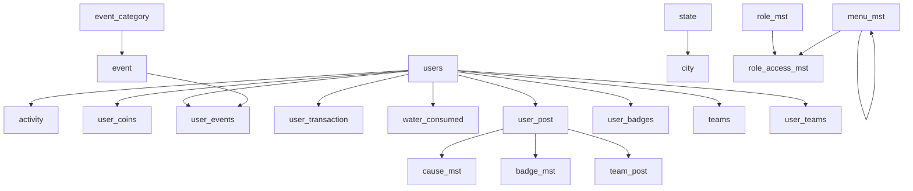
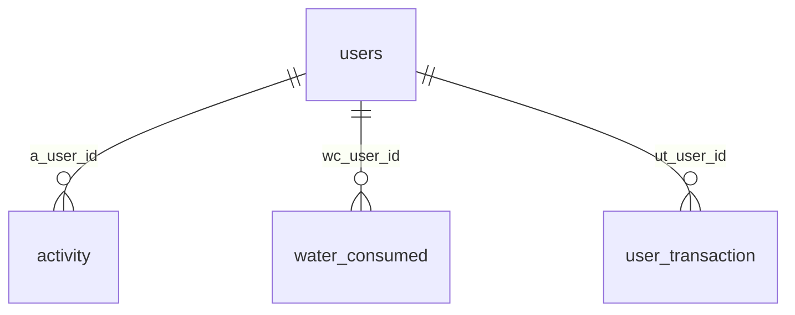
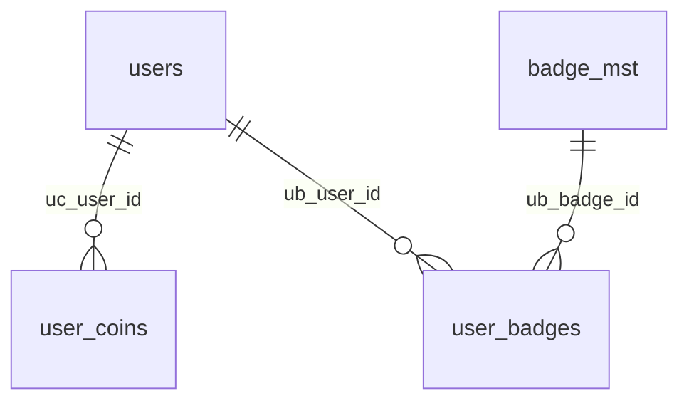
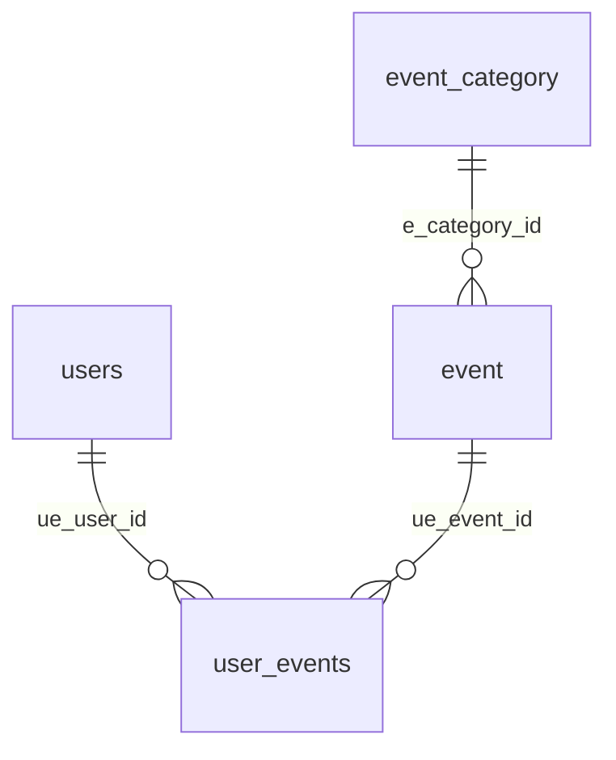
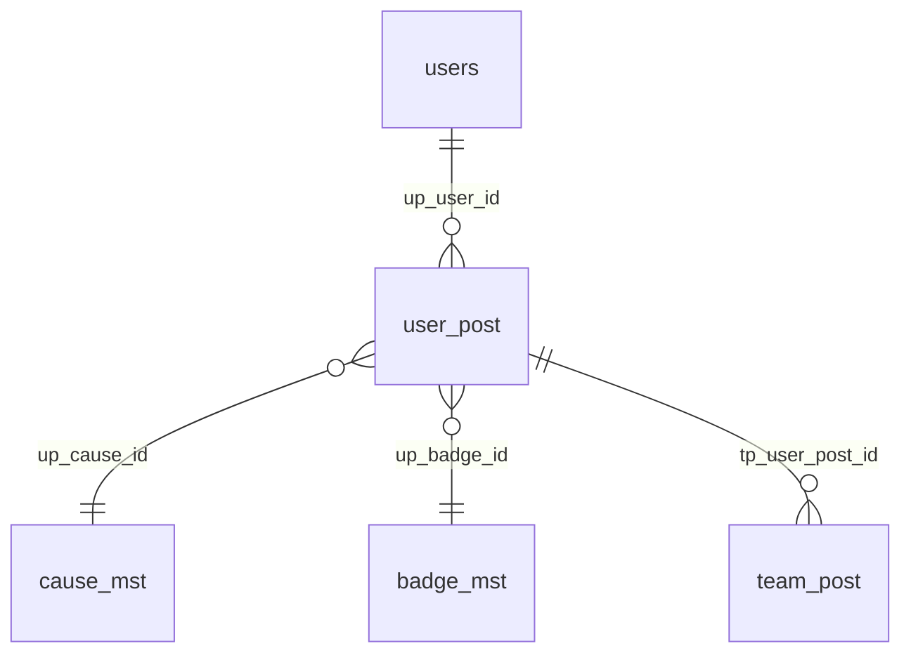
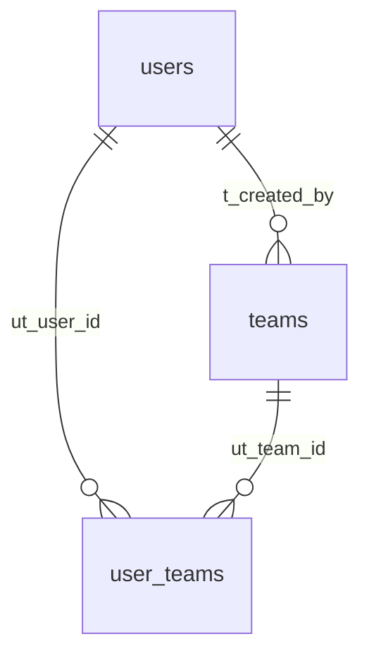
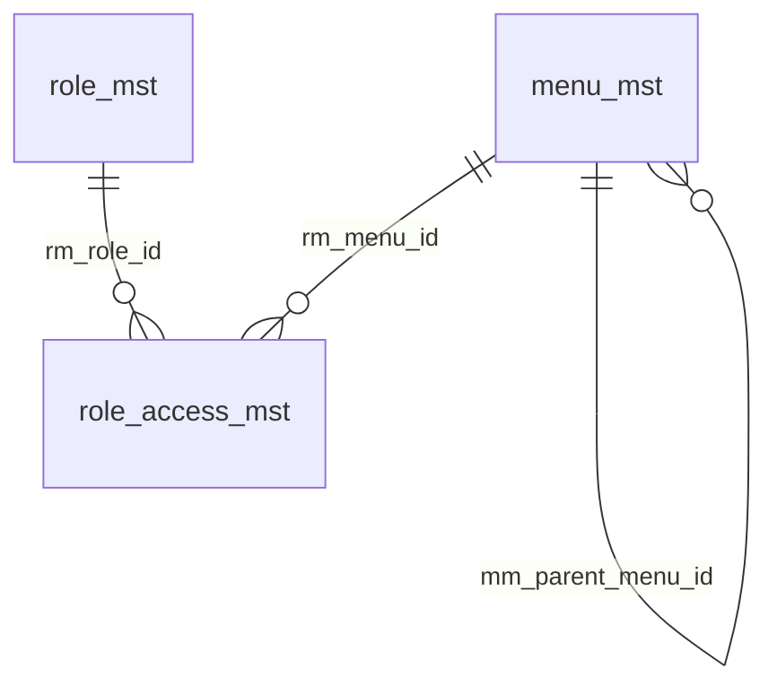
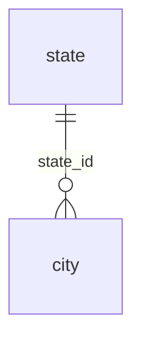

# Database schema overview

High-level view of how the main tables connect. **`users`** is the central entity; most user-facing data hangs off it.

Source: `DDl.sql` (schema `activity_prod`). Full DDL has more tables (challenges, offers, notifications, etc.)—this doc focuses on the core relationships already modeled in the app.

---

## At a glance

---

## 1. User activity & wellness

Tracks what a user does day-to-day.

| Table | Links to | Purpose |
|-------|----------|---------|
| `activity` | `users` (`a_user_id`) | User activity records |
| `water_consumed` | `users` (`wc_user_id`) | Water intake |
| `user_transaction` | `users` (`ut_user_id`) | Transactions |

---

## 2. Coins & badges

Gamification: coins earned and badges awarded.

| Table | Links to | Purpose |
|-------|----------|---------|
| `user_coins` | `users`, `coins_mst`* | Coins per user |
| `user_badges` | `users`, `badge_mst`* | Badges earned |
| `badge_mst` | — | Badge catalog |

\* `coins_mst` / `user_badges` → `badge_mst` use indexes in DDL, not formal FK constraints.

---

## 3. Events

Events belong to a category; users enroll via `user_events`.

| Table | Links to | Purpose |
|-------|----------|---------|
| `event_category` | — | Event types |
| `event` | `event_category`* (`e_category_id`) | Event definitions |
| `user_events` | `users`, `event` | User ↔ event enrollment |

\* Category link is indexed, not a formal FK in DDL.

---

## 4. Posts & causes

User posts can reference a cause and badge; team posts mirror a user post.

| Table | Links to | Purpose |
|-------|----------|---------|
| `user_post` | `users`, `cause_mst`, `badge_mst` | User-generated posts |
| `cause_mst` | — | Causes catalog |
| `team_post` | `user_post` | Team-visible copy of a post |

---

## 5. Teams

Teams are created by a user; membership is many-to-many via `user_teams`.

| Table | Links to | Purpose |
|-------|----------|---------|
| `teams` | `users`* (`t_created_by`) | Team record |
| `user_teams` | `users`, `teams`* | Membership |

\* Indexed relationships, not formal FKs in DDL.

---

## 6. Admin & access control (RBAC)

Roles get menu permissions; menus can nest under a parent menu.

| Table | Links to | Purpose |
|-------|----------|---------|
| `role_mst` | — | Roles |
| `menu_mst` | `menu_mst`* (`mm_parent_menu_id`) | Menu tree |
| `role_access_mst` | `role_mst`, `menu_mst`* | Role ↔ menu permissions |

\* Menu links use indexes, not formal FKs in DDL.

---

## 7. Geography

Simple hierarchy for location data.

---

## Relationship reference

| From table | Column | To table | Column | FK in DDL? |
|------------|--------|----------|--------|------------|
| `activity` | `a_user_id` | `users` | `id` | Yes |
| `user_coins` | `uc_user_id` | `users` | `id` | Yes |
| `user_coins` | `uc_coin_id` | `coins_mst` | `id` | Index only |
| `user_events` | `ue_user_id` | `users` | `id` | Yes |
| `user_events` | `ue_event_id` | `event` | `id` | Yes |
| `user_transaction` | `ut_user_id` | `users` | `id` | Yes |
| `water_consumed` | `wc_user_id` | `users` | `id` | Yes |
| `user_post` | `up_user_id` | `users` | `id` | Yes |
| `user_post` | `up_cause_id` | `cause_mst` | `id` | Yes |
| `user_post` | `up_badge_id` | `badge_mst` | `id` | Yes |
| `team_post` | `tp_user_post_id` | `user_post` | `id` | Yes |
| `event` | `e_category_id` | `event_category` | `id` | Index only |
| `city` | `state_id` | `state` | `id` | Yes |
| `role_access_mst` | `rm_role_id` | `role_mst` | `id` | Yes |
| `role_access_mst` | `rm_menu_id` | `menu_mst` | `id` | Index only |
| `menu_mst` | `mm_parent_menu_id` | `menu_mst` | `id` | Index only |
| `user_badges` | `ub_user_id` | `users` | `id` | Index only |
| `user_badges` | `ub_badge_id` | `badge_mst` | `id` | Index only |
| `teams` | `t_created_by` | `users` | `id` | Index only |
| `user_teams` | `ut_user_id` | `users` | `id` | Index only |
| `user_teams` | `ut_team_id` | `teams` | `id` | Index only |

For the full mapping list used in Sequelize, see `src/models/foreignKeyMappings.js`.
